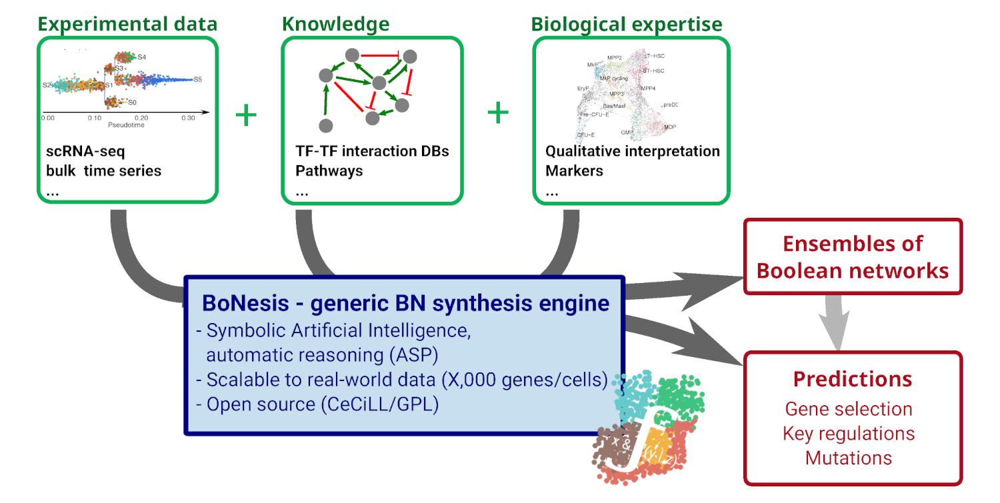

# BoNesis: Synthesis and reprogramming of Boolean networks

BoNesis is a Python library which offers a declarative framework for the synthesis of Boolean networks from advanced dynamical properties, such as reachability, bifurcation, minimal trap spaces, stable states, and mutations. It combines recent theoretical advances on Boolean networks with the Most Permissive update mode and the logic programming framework of Answer-Set Programming. Its main application domain is the inference of Boolean models from bulk and single-cell gene expression data of cellular differentiation and reprogramming processes.



BoNesis is distributed under the GPLv3-compatible Free Software license CeCILL and available at https://github.com/bnediction/bonesis.


```{tableofcontents}
```
